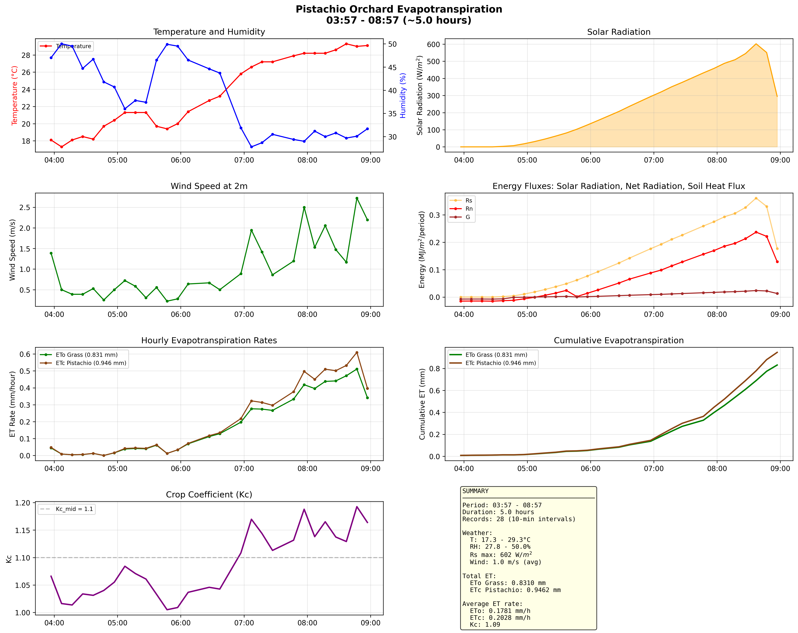
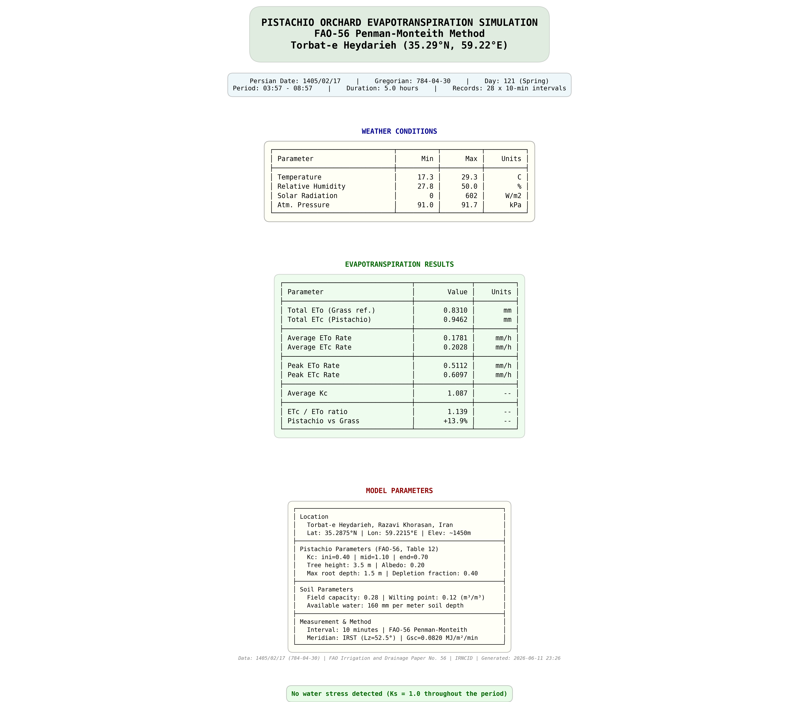

# Pistachio Orchard Evapotranspiration Analysis

FAO-56 Penman-Monteith implementation for evapotranspiration analysis of a pistachio orchard in **Torbat-e Heydarieh, Razavi Khorasan, Iran**.

## 📍 Location

| Parameter | Value |
|-----------|-------|
| **Site** | Pistachio Orchard |
| **City** | Torbat-e Heydarieh (تربت حیدریه) |
| **Province** | Razavi Khorasan, Iran |
| **Coordinates** | 35.2875° N, 59.2215° E |
| **Elevation** | ~1,450 m above sea level |

## 📊 Sample Output

### Evapotranspiration Analysis

### Summary Report

## 🔬 Methodology

This project implements the standardized **FAO-56 Penman-Monteith method** for calculating reference evapotranspiration ($ET_0$) and crop evapotranspiration ($ET_c$).

### Key Equations

**Penman-Monteith $ET_0$ (sub-hourly):**

$$ET_0 = \frac{0.408 \cdot \Delta \cdot (R_n - G) + \gamma \cdot \frac{37 \cdot t_i}{T + 273} \cdot u_2 \cdot (e_s - e_a)}{\Delta + \gamma \cdot (1 + 0.24 \cdot u_2)}$$

**Crop Evapotranspiration:**

$$ET_c = K_c \cdot ET_0$$

**Climate-Adjusted Crop Coefficient (FAO-56 Eq. 62):**

$$K_{c\text{ mid}} = K_{c\text{ mid}(Tab)} + \left[0.04 \cdot (u_2 - 2) - 0.004 \cdot (RH_{min} - 45)\right] \cdot \left(\frac{h}{3}\right)^{0.3}$$

### Implementation Details

| Component | Method |
|-----------|--------|
| **$ET_0$** | FAO-56 Penman-Monteith (adapted for sub-hourly intervals) |
| **Crop Coefficient** | Single Kc with climate adjustment |
| **Solar Geometry** | Full calculation (declination, equation of time, hour angle) |
| **Net Radiation** | Shortwave + Longwave balance |
| **Soil Heat Flux** | Simplified FAO-56 method (G = 0.1·Rn day, 0.5·Rn night) |
| **Water Stress** | Soil water balance with Ks coefficient |
| **Date Handling** | Automatic Persian (Jalali) to Gregorian conversion |

## 🌳 Pistachio Parameters

Source: FAO-56 Table 12

| Growth Stage | Kc | Description |
|-------------|-----|-------------|
| **Initial** ($K_{c\text{ ini}}$) | 0.40 | Early season, sparse canopy |
| **Mid-season** ($K_{c\text{ mid}}$) | 1.10 | Full canopy, peak water demand |
| **Late-season** ($K_{c\text{ end}}$) | 0.70 | Pre-harvest, declining water use |

| Physical Parameter | Value |
|-------------------|-------|
| Tree height | 3.5 m |
| Albedo (α) | 0.20 |
| Maximum root depth | 1.5 m |
| Depletion fraction (p) | 0.40 |

## 📈 Features

- **Sub-hourly calculations**: 10-minute interval ET computation
- **Energy balance tracking**: Rs → Rn → G → Available Energy
- **Climate-adjusted Kc**: Dynamic crop coefficient based on wind and humidity
- **Soil water balance**: Depletion tracking and stress detection
- **Automatic date parsing**: Extracts Persian (Jalali) dates from data
- **Publication-ready plots**: High-resolution visualizations
- **Summary reports**: Professional formatted output images

## 📦 Requirements
- Python >= 3.8
- numpy >= 1.21.0
- pandas >= 1.3.0
- matplotlib >= 3.5.0
